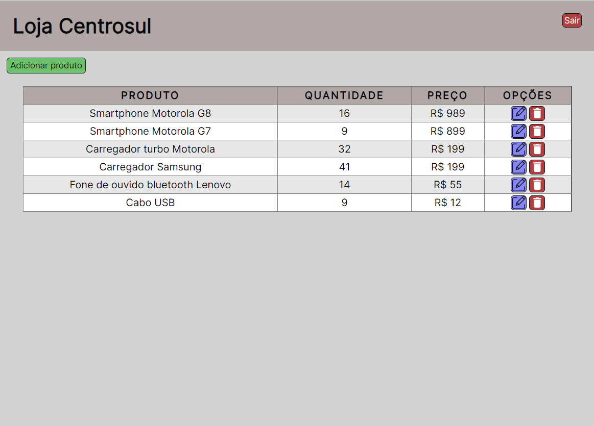
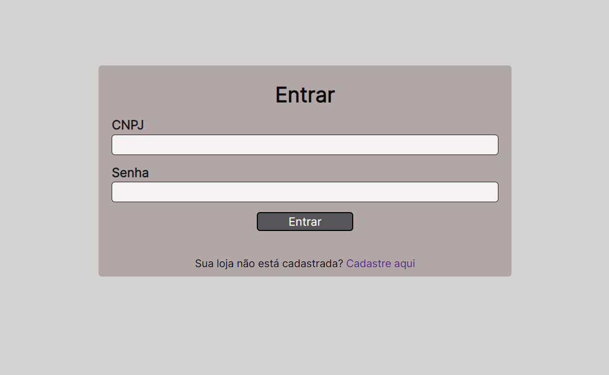
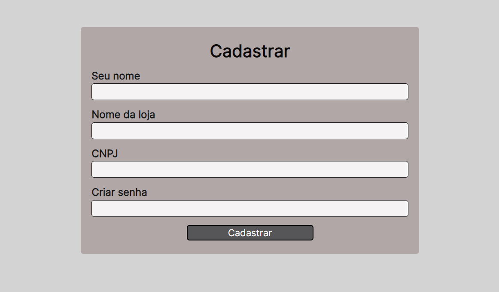

<h1 align="center">Gerenciador de estoque</h1>
<h4 align="center">Sistema que permite realizar o cadastro da loja para ter um controle sobre seu estoque</h4>
<h4 align="center">Feito com HTML, CSS e JavaScript</h4>

&#xa0;

**
Sumário
**

<a href="#dart-sobre">Sobre</a> &#xa0; | &#xa0;
<a href="#white_check_mark-funcionalidades">Funcionalidades</a> &#xa0; | &#xa0;
<a href="#computer-tecnologias">Tecnologias</a> &#xa0; | &#xa0;
<a href="#hammer_and_wrench-serviços">Serviços</a>

<a href="#camera-imagens">Imagens</a> &#xa0; | &#xa0;
<a href="#orange_book-como-usar">Como usar</a> &#xa0; | &#xa0;
<a href="#scroll-pré-requisitos">Pré-requisitos</a> &#xa0; | &#xa0;
<a href="#link-links">Links</a> &#xa0; | &#xa0;
<a href="#sparkles-autor">Autor</a>

## :dart: Sobre
Esse projeto foi criado no intuito de ser uma ferramenta para administradores ou gerentes de qualquer loja ou comércio. Consiste em registrar o cadastro do estabelecimento e disponibilizar ao usuário uma tabela de gerenciamento dos produtos, feita com sistema CRUD.

&#xa0;

## :white_check_mark: Funcionalidades
As principais funcionalidades do projeto são:

✔️ Cadastro de loja;

✔️ Sistema de login que valida se a loja está cadastrada;

✔️ Gerenciador de estoque;

✔️ Facilidade de executar as funções do gerenciador (adicionar, editar ou excluir produto);

✔️ Para gerenciar outra loja, basta clicar no botão de "logout" e entrar com os dados da outra conta.

&#xa0;

## :computer: Tecnologias
* [HTML](https://developer.mozilla.org/pt-BR/docs/Web/HTML)

* [CSS](https://developer.mozilla.org/pt-BR/docs/Web/CSS)

* [JavaScript](https://www.javascript.com/)

&#xa0;

## :hammer_and_wrench: Serviços
* <a href="https://github.com/">GitHub</a>

* <a href="https://www.netlify.com/">Netlify </a>- hospedagem

&#xa0;

## :camera: Imagens
**
Tela para gerenciamento do estoque:
**

---
**
Tela de login:
**

---
**
Tela para cadastro de nova loja:
**

---

&#xa0;

## :orange_book: Como usar

Acesse a aplicação pelo link. Caso sua loja ainda não esteja cadastrada, clique em "cadastre aqui" para poder realizar o cadastro.

Depois do cadastro ser realizado, faça login para acessar o gerenciador, onde está a tabela (sistema CRUD) dos produtos com as seguintes opções:

<ul>
  <li>Adicionar novo produto;</li> 
  <li>Editar produto na tabela;</li> 
  <li>Excluir um produto do seu estoque.</li>
</ul>

Caso queira entrar com outra conta, não se preocupe, seu estoque está salvo no localStorage do seu navegador! Basta clicar no botão "Sair" para encerrar sua seção.

**
⚠️ Caso você limpe os dados de navegação, os dados do localStorage do seu navegador serão apagados.
**

&#xa0;

## :scroll: Pré requisitos
Para utilizar o sistema, basta um navegador de sua preferência e conexão com internet.

&#xa0;

## :link: Links
* Repositório: https://github.com/CaioAugustoHD/Gerenciador-estoque
* Deploy: https://gerenciadorestoque.netlify.app/

&#xa0;

## :sparkles: Autor
<h4>Feito por Caio Augusto Pereira</h4>

&#xa0;

 

